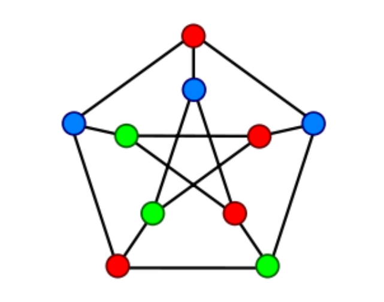

# Any Colony Optimization - Swarm Intelligence

This repository contains the second assignment for the course ```CS 451 - Computational Intelligence```. The assignment is about ```Ant Colony Optimization (ACO)```, and optimizing the ```Graph Coloring Problem``` using ```ACO```.

### Graph Coloring Problem

Graph coloring is a classic problem in Computer Science in which you are required to color the vertices of a graph (vertex coloring) with minimum colors such that no two adjacent vertices are of same color (as shown in the image below). 



To solve this problem, Ant-Colony Optimization was implemented, and the *queen11_11.col* and *le450-1b.col* datasets were used which can be accessed from [here](https://mat.tepper.cmu.edu/COLOR/instances.html).